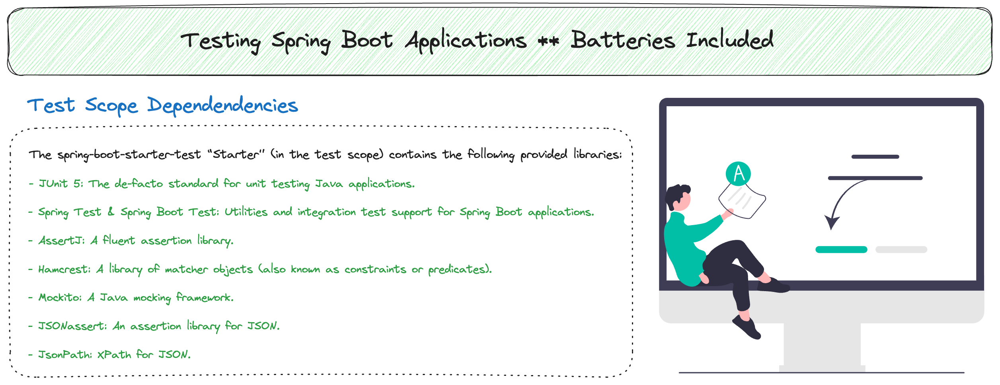

# Spring Boot Testing ** Batteries Included 🔋🔋

In this tutorial you will learn what you get out of the box when it comes to testing your Spring Boot applications. When you
create a new Spring Boot application at start.spring.io the `spring-boot-starter-test` dependency is added to your project for
you. We also generate a test for you with a single method called `contextLoads()`.

It is important to know what libraries are included so that when you see tests you can identify what is happening.

[YouTube Video](https://youtu.be/rUbjV3VY1DI)

